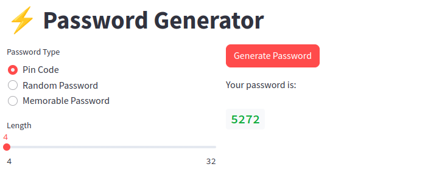

# Password Generator Streamlit App

A simple and interactive web application to generate various types of passwords including pin codes, random passwords, and memorable passwords. This app is built using the [Streamlit](https://streamlit.io) framework, making it easy to run and deploy. The password generation logic leverages the [Natural Language Toolkit (NLTK)](https://www.nltk.org/) for the memorable password generator.

## Features

- Generate numeric Pin Codes with variable length.
- Create random passwords with options to include numbers and symbols.
- Construct memorable passwords from a word list, with customization options for the number of words, separator, and capitalization.

## Installation and Usage

To get started with the password generator app, you need to have Python installed on your system. This project also requires the additional libraries specified in `requirements.txt`.

Follow these steps to set up the project:

1. Clone the repository to your local machine

2. Navigate to the project directory

3. Install the required Python packages:

```
pip install -r requirements.txt
```

4. First navigate to `src` directory then run the Streamlit app:

```
streamlit run app.py
```

After running the command, Streamlit will launch the app in your default web browser.
